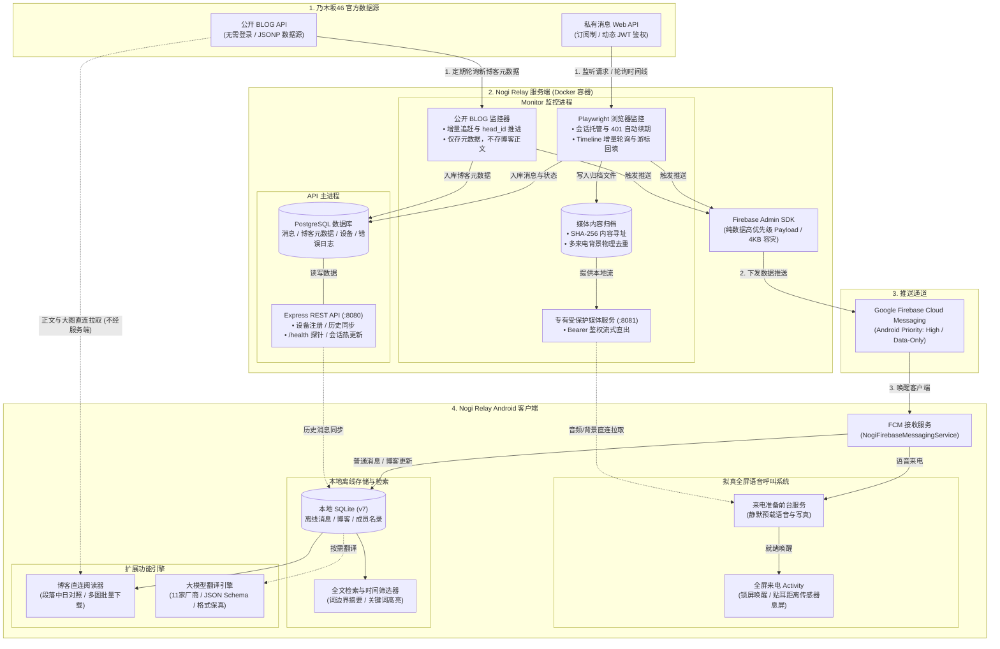
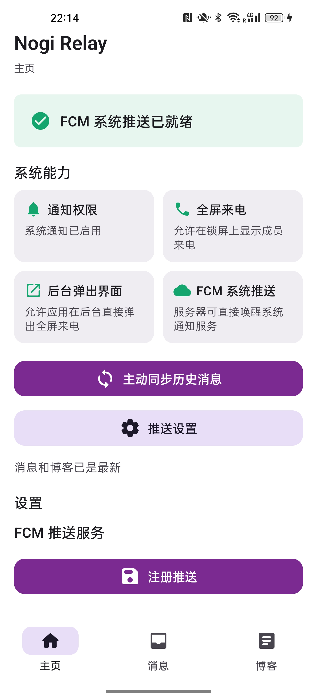
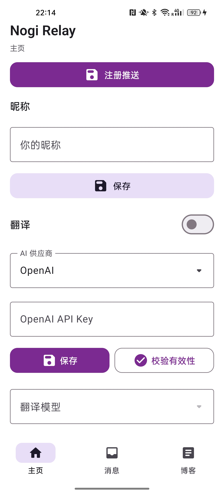
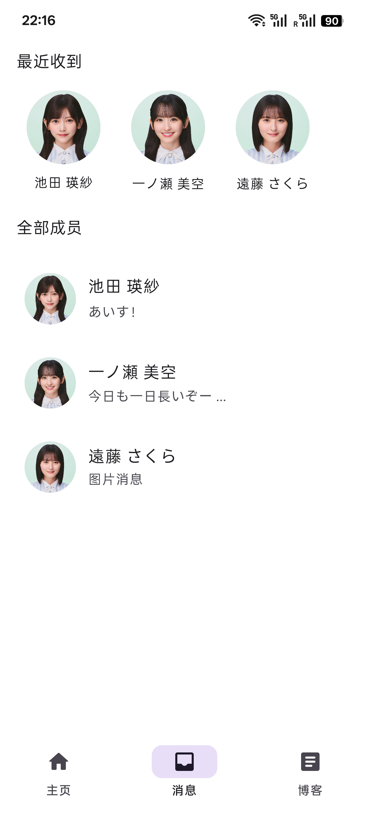
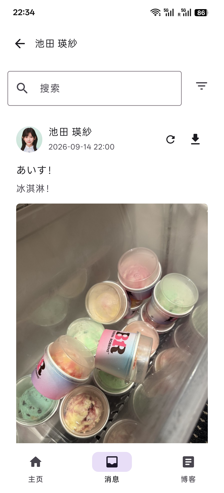
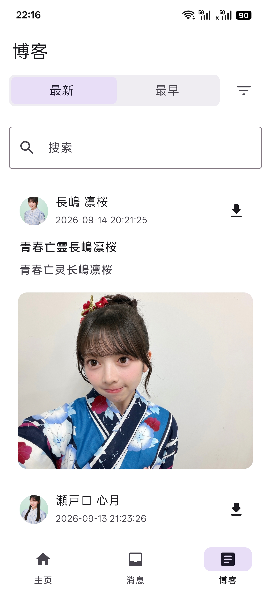
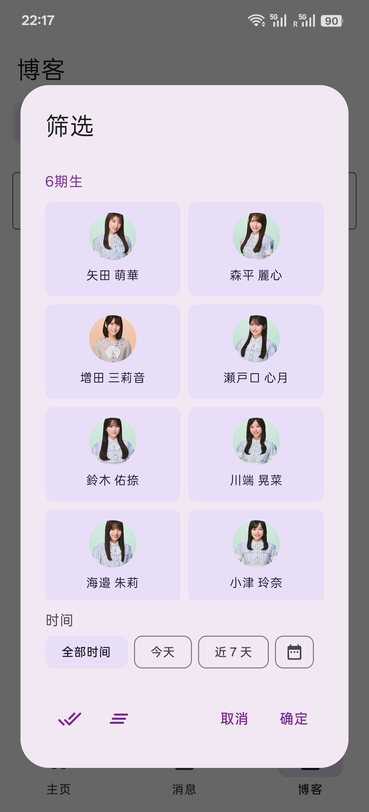
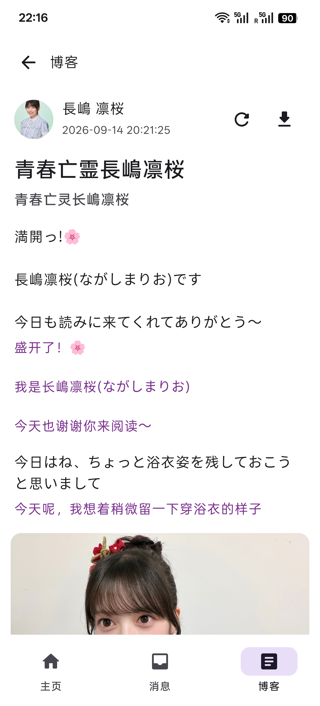
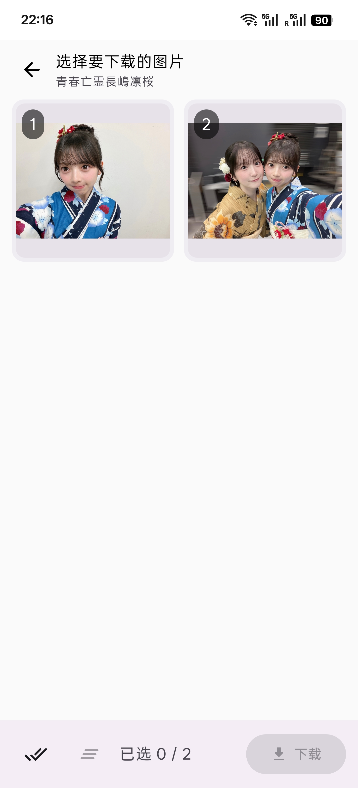

# Nogi Relay (乃木坂46 消息与博客中继系统)

<p align="center">
  
  
  
  
  
  
  
</p>

**Nogi Relay** 是专为乃木坂46 message和 BLOG 打造的中继推送与管理系统。

系统通过无头浏览器会话自动监听乃木坂message消息与公开博客，实现媒体资源的本地持久化归档与 SHA-256 去重；通过 Firebase Cloud Messaging (FCM) 发送纯数据高优先级推送；配合原生 Android 客户端，提供模拟全屏语音呼叫、11 家大模型上下文自动翻译、全文检索及博客和消息原图下载。

---

## 📚 文档导航

| 文档 | 核心用途与内容 |
| :--- | :--- |
| 🚀 **[DEPLOYMENT.md](DEPLOYMENT.md)** | **生产部署与运维指南**：在 Fly.io 等在线服务器上一键部署、配置密钥、上传会话与推送验收 |
| 📖 **[DEVELOPMENT.md](DEVELOPMENT.md)** | **开发全景文档**：系统架构深度解析、双进程设计、数据库平滑演进、全套 REST API 规范、全屏来电与大模型翻译实现原理、本地调试与测试 |
| 🖥️ **[server/README.md](server/README.md)** | **服务端代码索引**：服务端核心代码入口、运行脚本与服务架构导读 |

---

## 🏛️ 系统架构概览



- **双进程容器架构**：主 API 进程（提供 REST API、设备管理与 `/health` 探针）与 Monitor 进程（Chromium 会话轮询、博客监控与 8081 独立媒体服务）在物理上分离运行，确保即使浏览器高负载或崩溃，外部服务与会话热更新接口依然 100% 可用。
- **正文分离同步设计**：Relay 服务端仅保存用于去重、防漏和推送通知的博客元数据，正文与高清图片由 Android 客户端直接从官网并发异步拉取，极大节省服务端网络与存储开销。

---

## 📱 界面预览 / Screenshots

<table align="center">
  <tr>
    <th width="25%" align="center">主页仪表盘与状态</th>
    <th width="25%" align="center">大模型与昵称配置</th>
    <th width="25%" align="center">消息列表与最近动态</th>
    <th width="25%" align="center">私信流翻译与关键词检索</th>
  </tr>
  <tr>
    <td align="center"></td>
    <td align="center"></td>
    <td align="center"></td>
    <td align="center"></td>
  </tr>
  <tr>
    <th width="25%" align="center">博客列表与关键词检索</th>
    <th width="25%" align="center">期别成员与时间筛选</th>
    <th width="25%" align="center">中日双语对照阅读</th>
    <th width="25%" align="center">博客原图下载</th>
  </tr>
  <tr>
    <td align="center"></td>
    <td align="center"></td>
    <td align="center"></td>
    <td align="center"></td>
  </tr>
</table>

---

## 🌟 核心特性

### 1. 官网会话托管与智能生命周期状态机
- **自动续期**：无头 Chromium 托管移动端官网前端，截获短效 JWT 访问令牌；在令牌到期前或遇到 `401 Unauthorized` 时自动驱动官网续期，并仅对原始失败请求重试一次。
- **故障隔离与状态机**：官网 `/v2/update_token` 明确响应 `400` 时，进入 `signedOut` 状态，立即挂断 Chromium 与轮询，并在日志中每 5 分钟输出一次标准化警告；其他鉴权失败按阈值隔离；主 API 保持常驻。
- **在线热更新**：支持通过 `upload-session.js` 脚本向服务端热上传新会话文件（以原子写入和 `0600` 私有文件权限保护），Monitor 监听变更后自动重载验证并恢复轮询，无需重启或重新部署容器。
- **⚠️Web 端单会话互斥注意**：官方 Message Web 版**只允许一个活跃会话存在**。若在其他浏览器再次登录 Web 版，服务端的会话将被官方注销（提示 `[NOGI_SESSION_UPDATE_REQUIRED]`），日常请通过 Nogi Relay 原生 App 或 官方移动端 APP 查看，避免多端冲突。
- **💡多端冲突恢复指引**：若因其他设备登录 Web 版导致服务端会话失效，**无需重启或重新部署云端容器**，只需两步热更新即可恢复：
  1. **提取新会话**：在本地电脑 `server/` 目录下运行 `npm run bootstrap:browser`，在弹出的浏览器中重新登录乃木坂账号，确保看到订阅页面的消息后按回车，生成新 `nogi-browser-state.json`；
  2. **上传并激活**：运行 `node upload-session.js ./nogi-browser-state.json <SERVER_URL> <ACCESS_TOKEN>`，终端提示 `✓ Session activated` 即表示云端已自动无缝重新接管并恢复消息轮询，且会自动补齐冲突断流期间错过的所有历史消息（详细操作与排查命令请查阅 [server/README.md](server/README.md#2-官网会话管理与热更新)）。

### 2. 过去消息全量回填与增量轮询
- **Continuation 游标遍历**：服务启动、新订阅成员出现或会话更新时，自动调用 `past_messages` 接口并完整遍历 timeline continuation 分页游标，历史消息全量回填入库且静默入库（不产生重复 FCM 推送）。
- **增量快速追赶**：已完成回填的成员在日常轮询中仅拉取最新一页（200 条），对比最高已存 ID 快速熔断。

### 3. SHA-256 媒体归档引擎与独立媒体流服务
- **内容寻址与多方去重**：所有语音、图片、视频及来电全屏写真按二进制 SHA-256 摘要寻址归档在持久化卷中。成员在多次来电中重复使用的写真在磁盘上只存一份。
- **受保护流式响应**：Monitor 内置专有 HTTP 服务（默认端口 `8081`），提供 `GET /v1/messages/:id/media/:kind`，受全局 Bearer 密钥保护，支持音视频断点式流式播放，规避官网 CloudFront 鉴权失效问题。

### 4. 模拟全屏语音来电系统 (Android)
- **保障机制**：FCM 收到语音消息后，通过前台服务（`dataSync`）提前在后台将语音音频与背景写真完整预下载至本地缓存，随后才唤起全屏呼叫，避免接听时网络卡顿。
- **全屏锁屏唤醒**：配置全屏意图（`USE_FULL_SCREEN_INTENT`）、锁屏展示（`showWhenLocked`）与亮屏拉起（`turnScreenOn`），配合电话铃声（`R.raw.ringtone`）与振动。
- **传感器**：接听贴近耳边时通过距离传感器自动熄屏（`PROXIMITY_SCREEN_OFF_WAKE_LOCK`）防误触。

### 5. 多大模型上下文感知翻译 (AI Translation System)
- **11 家主流模型支持**：覆盖 OpenAI、Kimi (Moonshot)、Claude (Anthropic)、DeepSeek、智谱 GLM、Google Gemini、通义千问 Qwen、xAI Grok、MiniMax、小米 MiMo、腾讯混元；支持 `MESSAGES`、`RESPONSES`、`GEMINI_GENERATE_CONTENT` 三类协议标准。
- **结构化输出保证 (JSON Schema)**：针对 Claude、OpenAI Responses、Gemini 强约束输出 `{"segments":[{"index":0,"text":"..."}]}`，其余厂商通过提示词约束；客户端统一通过 `IndexedSegmentTranslations` 进行严格的索引完备性校验。
- **抑制思考模式**：统一关闭或降级推理模型的深度思考模式（Claude 采用 `thinking: { type: "disabled" }`），单次请求超时放宽至 120 秒，降低翻译时延与费用。
- **格式还原**：采用 `TranslationLayout` 本地骨架回填算法，大模型仅翻译纯文本片段，译文严格还原原文的手动换行、空行与空格排版；昵称占位符 `%%%` 替换为用户自定义昵称。
- **界面参考**：[大模型与昵称配置面板](docs/images/02_settings_ai_translation.jpg) ｜ [消息双语排版](docs/images/04_message_detail_translation.jpg)

### 6. BLOG 监控、离线检索与多媒体管理器
- **边界推进算法**：服务端首次建立基线翻全部分页，日常增量追赶至已存头部 ID（`head_id_v1`），仅推送新博客元数据。
- **富文本排版与中日对照**：Android 客户端直接解析官方 JSONP 博客与成员名录，正文图片支持手势缩放与单图直下；译文段落以优雅紫色字体自适应嵌入且不影响正文边距。
- **全文检索**：支持跨成员、按时间段（今天/近7天/自定义年月日）与关键词检索；搜索结果高亮匹配可见字符，并在命中正文时提供前后词边界对齐的精准摘要（词前约 12 字、词后约 28 字）。
- **图片下载**：网格视图支持全选/单选一键批量下载全篇博客原图至系统相册。
- **界面参考**：[博客列表与搜索](docs/images/05_blog_list.jpg) ｜ [期别与时间多维筛选](docs/images/06_blog_filter_modal.jpg) ｜ [双语段落下嵌阅读](docs/images/07_blog_detail_reading.jpg) ｜ [原图下载管理器](docs/images/08_blog_images_batch_download.jpg)

---

## 📁 目录结构

```text
Nogizaka46-Relay/
├── docs/images/                # App 运行界面截图
├── app/                        # Android 原生客户端代码
│   ├── src/main/java/com/nogirelay/app/
│   │   ├── MainActivity.kt     # 主入口 (主页 / 消息 / 博客三 Tab 导航)
│   │   ├── blog/               # 博客解析、详情阅读、多图下载与通知
│   │   ├── call/               # 拟真来电、全屏呼叫、距离传感器与振动
│   │   ├── data/               # SQLite 数据库 (MessageDatabase)、API 客户端
│   │   ├── media/              # 媒体后台下载器、前台语音播放服务
│   │   ├── notification/       # Android 5 套专用通知渠道定义
│   │   ├── push/               # FCM 接收器 (NogiFirebaseMessagingService)
│   │   ├── translation/        # 大模型统一接口、11家厂商适配器与版式还原
│   │   └── ui/                 # Material 3 主题、时间筛选器、全屏媒体播放器
│   └── build.gradle.kts        # 客户端依赖与构建配置
├── server/                     # Node.js 中继服务端代码
│   ├── src/
│   │   ├── index.js            # 主 API 进程、健康检查与数据库迁移
│   │   ├── middleware/         # Bearer 认证中间件
│   │   ├── monitor/            # 监控进程 (nogi-browser, blog-monitor, media-server)
│   │   ├── routes/             # REST 路由 (messages, devices, push, admin)
│   │   └── services/           # 媒体归档、FCM 推送、会话持久化、错误日志
│   ├── database/schema.sql     # PostgreSQL 数据库初始化脚本
│   ├── scripts/audit-blog-api.js # 官方博客接口完整性审计工具
│   ├── test/                   # 核心逻辑端到端单元测试套件
│   ├── bootstrap-browser.js    # 交互式浏览器登录与会话抓取工具
│   ├── upload-session.js       # 在线会话热更新与激活校验命令行
│   ├── start-all.sh            # 生产双进程编排启动脚本
│   └── package.json            # 服务端依赖配置
├── Dockerfile                  # 基于 Playwright Noble 的生产镜像定义
├── fly.toml.example            # Fly.io 生产配置模板 
├── local.properties.example    # Android 本地 SDK 路径与预填参数配置模板
├── DEVELOPMENT.md              # 深度开发文档
└── DEPLOYMENT.md               # 生产部署与运维文档
```

---

## 🚀 快速上手

### 1. 服务端云端在线部署 (推荐)

若需要 7×24 小时稳定运行并为手机提供即时推送服务，推荐将服务端部署至云端容器平台（如 **Fly.io**）。

部署流程（创建应用、设置密钥、部署镜像、初始化数据库、上传会话与手机端验证），具体请直接查阅：
👉 **[生产部署与运维指南 (DEPLOYMENT.md)](DEPLOYMENT.md)**

> [!TIP]
> **多端冲突运维提示**：若因在其他设备登录 Web 版导致云端提示 `[NOGI_SESSION_UPDATE_REQUIRED]`，请查阅 [多端冲突恢复指引](#1-官网会话托管与智能生命周期状态机) 或 [server/README.md](server/README.md#2-官网会话管理与热更新) 进行两步热更新，无需重启服务。

---

### 2. 服务端本地运行 (开发与调试)

若仅在本地电脑进行开发、调试或跑测试：

```bash
# 进入服务端目录并安装依赖
cd server
npm install

# 配置环境变量 (复制模板)
cp .env.example .env
# 编辑 .env 配置你的 DATABASE_URL 与 ACCESS_TOKEN

# 初始化数据库
npm run db:setup

# 提取官网登录会话 (在弹出的浏览器中登录后回车)
npm run bootstrap:browser

# 启动本地开发服务 (API 端口 3000, 媒体端口 8081)
npm start
```

---

### 3. Android 客户端构建与安装

在项目根目录下复制模板并配置 `local.properties`：
```powershell
cp local.properties.example local.properties
```

在 `local.properties` 中填入本机 Android SDK 路径与可选私有参数：
```properties
sdk.dir=C:\\Users\\YOUR_USER\\AppData\\Local\\Android\\Sdk

# 可选：构建期直接注入私有参数
relay.baseUrl=https://YOUR_RELAY_HOST
relay.access.token=YOUR_ACCESS_TOKEN
```

执行编译：
```powershell
# 标准 Debug 构建
.\gradlew.bat :app:assembleDebug

# 简易模式（隐藏界面中的地址、令牌输入框及测试全屏来电按钮）
.\gradlew.bat :app:assembleDebug -PrelaySimpleUi=true --no-daemon
```

构建生成的 APK 位于 `app/build/outputs/apk/debug/app-debug.apk`（简易模式下自动命名为 `app-simple-debug.apk`）。

---

## 🔒 安全边界

1. **凭证不入库**：乃木坂46官网账号状态（`nogi-browser-state.json`）、FCM 服务账号私钥、PostgreSQL 连接串及各模型 API Key 均属于隐私，不会提交到公开仓库。
2. **通信全链路鉴权**：除公共 `/health` 探针外，所有 REST API 与 8081 媒体流接口均受共享 Bearer Token 校验保护。
3. **APK 分发安全**：公开分发 APK 前，切勿在 `local.properties` 中预置私有服务地址或访问凭证；生产环境应让使用者在应用设置页中按需配置。

---

## 📄 许可证与使用免责声明

1. 本项目代码遵循 **[MIT License](LICENSE)** 协议开源。
2. **版权归属**：乃木坂46（Nogizaka46）及其关联团体的名称、成员写真、语音通话、官方视频、成员博客及相关商标权全部归属 **Sony Music Entertainment (Japan) Inc. / Seed & Flower LLC** 及相关版权方所有。
3. **使用范围**：本项目仅供个人技术研究、自动化架构学习及正版订阅用户自身便利使用，严禁用于任何商业牟利、未经许可的内容再分发或侵权用途。部署与使用本项目须严格遵守相关法律法规及官网服务条款。
