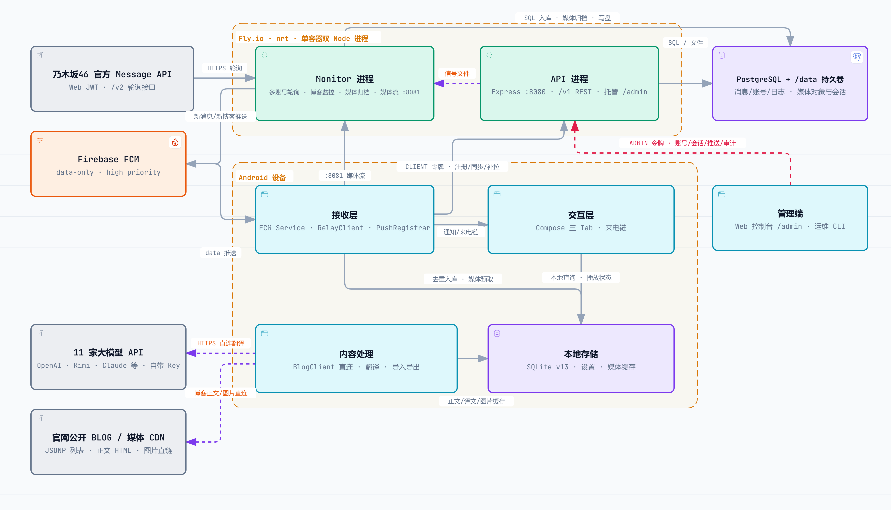

# Nogi Relay (乃木坂46 消息与博客中继系统)

<p align="center">
  
  
  
  
  
  
</p>

**Nogi Relay** 是专为乃木坂46 message和 BLOG 打造的中继推送与管理系统。

系统通过官方 API 自动监听乃木坂 message 消息与公开博客，实现媒体资源的本地持久化归档与 SHA-256 去重；通过 Firebase Cloud Messaging (FCM) 发送纯数据高优先级推送；配合原生 Android 客户端，提供模拟全屏语音呼叫、11 家大模型上下文自动翻译、全文检索、博客和消息原图下载，以及消息/博客归档的导入导出与媒体补齐。

---

## 📚 文档导航

| 文档 | 核心用途与内容 |
| :--- | :--- |
| 🚀 **[DEPLOYMENT.md](DEPLOYMENT.md)** | **生产部署与运维指南**：在 Fly.io 等在线服务器上一键部署、配置密钥、上传会话与推送验收 |
| 🖥️ **[server/README.md](server/README.md)** | **服务端运维与命令指南**：会话管理、REST API 操作、媒体下载、推送测试与排障命令 |

---

## 🏛️ 系统架构概览

[](docs/architecture/architecture.png)

[交互架构图](docs/architecture/architecture.html)

- **双进程容器架构**：主 API 进程（提供 REST API、设备管理与 `/health` 探针）和 Monitor 进程（API 会话轮询、博客监控与 8081 媒体服务）独立运行。
- **正文分离同步设计**：Relay 服务端仅保存用于去重、防漏和推送通知的博客元数据，正文与高清图片由 Android 客户端直接从官网同步，节省服务端网络与存储开销。

---

## 🌟 核心特性

### 1. 官网会话托管与生命周期状态机
- **自动续期与会话轮转**：服务端通过官方 `/v2/update_token` API 定期刷新 JWT 访问令牌，同时接收并持久化保存轮转的 `session` Cookie，保持会话长期有效。
- **故障隔离与状态机**：官网 `/v2/update_token` 响应 `400` 时，进入 `signedOut` 状态并暂停轮询，每 5 分钟在日志中输出一次警告；其他鉴权失败按阈值隔离；主 API 保持常驻。
- **在线热更新**：支持通过 `upload-session.js` 脚本向服务端热上传新会话文件（以原子写入和 `0600` 私有文件权限保护），Monitor 监听变更后自动重载验证并恢复轮询，无需重启或重新部署容器。
- **Web 端单会话互斥说明**：官方 Message Web 版仅允许一个活跃会话存在。若在其他浏览器再次登录 Web 版，服务端的会话将被官方注销（提示 `[NOGI_SESSION_UPDATE_REQUIRED]`）。
- **多端冲突恢复指引**：若服务端会话失效，可通过两步热更新恢复：
  1. **提取新会话**：在本地电脑 `server/` 目录下运行 `npm run bootstrap:browser`，在弹出的浏览器中登录乃木坂账号，看到消息后按回车生成新 `nogi-browser-state.json`；
  2. **上传并激活**：运行 `node upload-session.js ./nogi-browser-state.json <SERVER_URL> <ADMIN_TOKEN>`，终端提示 `✓ Session activated` 即完成更新。

### 2. 过去消息全量回填与增量轮询
- **Continuation 游标遍历**：服务启动、新订阅成员出现或会话更新时，自动调用 `past_messages` 接口并完整遍历 timeline continuation 分页游标；默认开启 `NOGI_BACKFILL_ON_START`，历史回填不发送推送。
- **增量轮询**：已完成回填的成员在日常轮询中拉取最新一页（200 条），按上一轮已处理的消息 ID 集合去重；处理失败的记录留待重试。

### 3. SHA-256 媒体归档引擎与独立媒体流服务
- **内容寻址与多方去重**：所有语音、图片、视频及来电全屏写真按二进制 SHA-256 摘要寻址归档在持久化卷中。成员在多次来电中重复使用的写真在磁盘上只存一份。
- **受保护流式响应**：Monitor 内置专有 HTTP 服务（默认端口 `8081`），提供 `GET /v1/messages/:id/media/:kind`，受全局 Bearer 密钥保护，支持音视频断点式流式播放，规避官网 CloudFront 鉴权失效问题。

### 4. 模拟全屏语音来电系统 (Android)
- **资源准备**：FCM 收到语音消息后，通过前台服务（`dataSync`）先缓存语音，并尝试预取背景写真；语音准备成功后显示来电，下载失败时显示可重试通知。
- **全屏锁屏唤醒**：配置全屏意图（`USE_FULL_SCREEN_INTENT`）、锁屏展示（`showWhenLocked`）与亮屏拉起（`turnScreenOn`），配合电话铃声（`R.raw.ringtone`）与振动。
- **传感器**：接听贴近耳边时通过距离传感器自动熄屏（`PROXIMITY_SCREEN_OFF_WAKE_LOCK`）防误触。
- **来电样式**：在「系统与翻译设置」的「来电页面」中选择「经典」或「液态玻璃」，默认经典，下次来电时生效。

### 5. 多大模型上下文感知翻译 (AI Translation System)
- **11 家主流模型支持**：覆盖 OpenAI、Kimi (Moonshot)、Claude (Anthropic)、DeepSeek、智谱 GLM、Google Gemini、通义千问 Qwen、xAI Grok、MiniMax、小米 MiMo、腾讯混元；支持 `MESSAGES`、`RESPONSES`、`GEMINI_GENERATE_CONTENT` 三类协议标准。
- **结构化输出与校验**：客户端按供应商和所选模型选择结构化输出策略，设置页显示「JSON Schema」「JSON 模式」或「提示词约束」。OpenAI、Claude、Kimi、Gemini、通义千问均有相应适配，具体能力取决于模型；所有结果都由 `IndexedSegmentTranslations` 校验片段数量与索引。
- **推理与超时策略**：按模型分别设置思考开关、推理强度或预算，部分模型保留低强度推理；网络连接超时为 15 秒，读取超时为 120 秒。
- **格式还原**：采用 `TranslationLayout` 本地骨架回填算法，大模型仅翻译纯文本片段，译文严格还原原文的手动换行、空行与空格排版；昵称占位符 `%%%` 替换为用户自定义昵称。
- **翻译范围**：AI 翻译默认关闭，配置供应商、API Key 与模型后启用。「消息全量翻译」和「博客全量翻译」可分别开启；关闭全量翻译时，新消息自动翻译，历史消息需手动触发，博客在新发布或打开阅读时翻译。「重新翻译全部」会清空本机消息与博客的译文后重新处理。

### 6. BLOG 监控、离线检索与多媒体管理器
- **边界推进算法**：服务端首次建立基线翻全部分页，日常增量追赶至已存头部 ID（`head_id_v1`），仅推送新博客元数据。
- **富文本排版与中日对照**：Android 客户端直接解析官方 JSONP 博客与成员名录，正文图片支持手势缩放、左右滑动切换与单图直下；译文段落以优雅紫色字体自适应嵌入且不影响正文边距。
- **全文检索**：支持跨成员、按时间段（今天/近7天/自定义年月日）与关键词检索；搜索结果高亮匹配可见字符，并在命中正文时提供前后词边界对齐的精准摘要（词前约 12 字、词后约 28 字）。
- **图片下载**：网格视图支持全选/单选一键批量下载全篇博客原图至系统相册。

### 7. 归档导入导出与媒体补齐 (Data Transfer)
- **ZIP 归档**：从「消息」或「博客」页的「数据管理」按成员导出对应内容，可分别选择是否包含媒体和译文。归档包含 `manifest.json`、`data/*.jsonl`，以及选中的本地媒体 `media/<sha256>.<ext>`；`data/skipped.jsonl` 记录跳过的缺失媒体。导入前可选择成员，并决定是否导入媒体及成员目录。
- **逐条合并导入**：每条记录在独立事务中写入；重复记录可刷新归档提供的有效链接，并补写本地缺失的译文。重复博客仅在本地正文缺失或正文内容一致时更新正文，补写译文还要求标题与正文一致，避免旧归档覆盖不同版本的文章。单行解析失败不影响其余记录。
- **离线导出与后台补齐**：导出只打包本地已缓存的媒体，不会自动联网补下载；可先在数据管理中点击「补齐缺失媒体」，由前台服务完成下载。HTTP 404 会按 URL 持久记录，后续跳过该失效链接。
- **成员目录与期别归一化**：归档携带成员目录行；期别分类统一折回 `6/5/4/3/2/1期生 + 運営スタッフ`，筛选按分类字符串分组不再出现重复分区；头像优先取成员表，为空时回落到博客表。

### 8. Web 管理后台 (Admin Dashboard)
- **多账号管理**：支持同时托管多个官方 message 订阅账号，每个账号可独立设置标识和备注，独立上传/更新会话、暂停/恢复轮询；展示访问令牌有效期进度条、续期状态与下次自动续期时间，支持一键主动续期。
- **跨账号去重**：多个账号拉取到同一消息时，系统自动按消息 ID 去重，入库和推送只执行一次，`source_accounts` JSONB 字段追踪消息来源。
- **系统总览**：实时显示进程内存用量（RSS / Heap）、磁盘卷估算、消息统计、实例运行时长与当次部署时间。
- **消息浏览与筛选**：支持按成员、类型（文字/语音/图片/视频）、账号、关键词多维筛选，分页浏览全部消息记录并可跳转指定页，内嵌图片/音频/视频直接播放，图片支持点击放大预览。
- **设备与推送**：查看已注册 FCM 设备、修改设备备注、发送测试推送、撤回上次推送。
- **推送管理**：分页浏览全部推送记录，按推送状态、目标设备与关键词筛选，查看推送详情（成员、类型、内容、FCM ID、失败原因），按设备撤回已送达的通知，支持跳转指定页。
- **审计日志**：默认仅显示当次部署以来的日志，可切换至历史全量日志，按级别和关键词筛选。
- **移动端适配**：响应式布局，适配手机端浏览与操作。

---

## 📁 目录结构

```text
Nogizaka46-Relay/
├── docs/
│   └── architecture/           # 架构图 (JSON / HTML / PNG)
├── app/                        # Android 原生客户端代码
│   ├── src/main/java/com/nogirelay/app/
│   │   ├── MainActivity.kt     # Activity 入口 (生命周期、Intent 分发与听筒防误触)
│   │   ├── UnreadTag.kt        # 公共未读角标组件
│   │   ├── blog/               # 博客解析、详情阅读、多图下载与通知
│   │   ├── call/               # 拟真来电、全屏呼叫、距离传感器与振动
│   │   ├── data/               # SQLite 数据库 (MessageDatabase)、API 客户端
│   │   │   ├── sync/           # 内容同步中枢 (ContentSyncManager)
│   │   │   └── transfer/       # 归档格式、导入导出、媒体补齐
│   │   │                       #   (ExportFormat / DataExporter / DataImporter)
│   │   ├── media/              # 媒体后台下载器、前台语音播放服务
│   │   ├── notification/       # 来电、准备、消息、博客、播放、媒体补齐 6 类通知渠道
│   │   ├── push/               # FCM 接收器 (NogiFirebaseMessagingService)
│   │   ├── translation/        # 大模型统一接口、11家厂商适配器与版式还原
│   │   └── ui/                 # Compose / Material 3 与自定义玻璃控件
│   │       ├── glass/          # 玻璃材质、按钮、弹层与导航组件
│   │       ├── home/           # 主页仪表盘与权限状态 (HomeScreen)
│   │       ├── messages/       # 消息列表、会话抽屉与卡片 (MessagesScreen)
│   │       ├── navigation/     # 全局三 Tab 导航与脚手架 (RelayApp)
│   │       ├── settings/       # 大模型配置与推送设置面板 (SettingsSection)
│   │       └── transfer/       # 归档导入导出抽屉与成员选择器
│   ├── src/main/kotlin/com/nogirelay/app/data/api/ApiConfig.kt
│   │                           # BuildConfig 同步地址与令牌入口
│   └── build.gradle.kts        # 客户端依赖与构建配置
├── server/                     # Node.js 中继服务端代码
│   ├── src/
│   │   ├── index.js            # 主 API 进程、健康检查与数据库初始化端点
│   │   ├── middleware/         # Bearer 认证中间件
│   │   ├── monitor/            # 监控进程、浏览器会话提取、博客与媒体服务
│   │   ├── routes/             # REST 路由 (messages, devices, push, admin)
│   │   └── services/           # 媒体归档、FCM 推送、会话持久化、错误日志
│   ├── public/admin/index.html  # Web 管理后台 SPA (TailwindCSS 单文件)
│   ├── database/schema.sql     # PostgreSQL 数据库初始化脚本
│   ├── scripts/audit-blog-api.js # 官方博客接口完整性审计工具
│   ├── upload-session.js       # 在线会话热更新与激活校验命令行
│   ├── start-all.sh            # 生产双进程编排启动脚本
│   └── package.json            # 服务端依赖配置
├── Dockerfile                  # 基于 Node.js Slim 的生产镜像定义
├── fly.toml.example            # Fly.io 生产配置模板 
├── local.properties.example    # Android 本地 SDK 路径与预填参数配置模板
└── DEPLOYMENT.md               # 生产部署与运维文档
```

---

## 🚀 快速上手

### 1. 服务端云端在线部署 (推荐)

若需要 7×24 小时稳定运行并为手机提供即时推送服务，推荐将服务端部署至云端容器平台（如 **Fly.io**）。

部署流程（创建应用、设置密钥、部署镜像、初始化数据库、上传会话与手机端验证），具体请直接查阅：
👉 **[生产部署与运维指南 (DEPLOYMENT.md)](DEPLOYMENT.md)**

> [!TIP]
> **多端冲突运维提示**：若因在其他设备登录 Web 版导致云端提示 `[NOGI_SESSION_UPDATE_REQUIRED]`，请查阅 [多端冲突恢复指引](#1-官网会话托管与生命周期状态机) 或 [server/README.md](server/README.md#2-官网会话管理与热更新) 进行两步热更新，无需重启服务。

---

### 2. 服务端本地运行 (开发与调试)

若仅在本地电脑进行开发或调试：

```bash
# 进入服务端目录并安装依赖
cd server
npm install

# 配置环境变量 (复制模板)
cp .env.example .env
# 编辑 .env 配置你的 DATABASE_URL、ADMIN_TOKEN 与 CLIENT_TOKEN

# 初始化默认本地数据库（postgres 用户、nogi_relay 数据库）
npm run db:setup

# 提取官网登录会话 (在弹出的浏览器中登录后回车)
npm run bootstrap:browser

# 终端 1：启动 API（默认端口 3000）
npm start

# 终端 2：启动消息/博客 Monitor 与媒体服务（默认端口 8081）
npm run monitor
```

`db:setup` 脚本不会读取 `.env` 中的 `DATABASE_URL`；使用其他数据库时，请改用 `psql "<DATABASE_URL>" -f database/schema.sql`。上面的 HTTP 本地服务可用于命令行调试；手机 App 连接时需提供可访问的 HTTPS 地址。

---

### 3. Android 客户端构建与安装

当前工程使用 Android SDK Platform 37（`compileSdk` / `targetSdk = 37`）和项目自带的 Gradle 9.8.0 Wrapper，Java 编译目标为 17；安装设备最低要求 Android 8.0（API 26）。本机需准备兼容该 Gradle 版本的 JDK 与对应 Android SDK。

在项目根目录下复制模板并配置 `local.properties`：
```powershell
cp local.properties.example local.properties
```

在 `local.properties` 中填入本机 Android SDK 路径与可选私有参数：
```properties
sdk.dir=C:\\Users\\YOUR_USER\\AppData\\Local\\Android\\Sdk

# 可选：构建期直接注入私有参数
relay.baseUrl=https://YOUR_RELAY_HOST
relay.access.token=YOUR_CLIENT_TOKEN
```

这些地址与令牌可留空，安装后在 App 的「主页」→「系统与翻译设置」中填写。App 的同步地址必须使用 **HTTPS**。构建时也可用 `RELAY_BASE_URL`、`RELAY_ACCESS_TOKEN` 环境变量或 `-PrelayBaseUrl=...`、`-PrelayAccessToken=...` 传入；环境变量优先于 Gradle 参数，Gradle 参数优先于 `local.properties`。

要使用 FCM 推送，请在与服务端相同的 Firebase 项目中注册包名为 `com.nogirelay.app` 的 Android 应用，将下载的 `google-services.json` 放到 `app/`，或通过 `GOOGLE_SERVICES_JSON` 环境变量提供完整 JSON。未配置 Firebase 时仍可编译，但无法注册和接收 FCM 推送。

执行编译：
```powershell
# 标准 Debug 构建
.\gradlew.bat :app:assembleDebug

# 简易模式（隐藏设置中的「测试全屏来电」按钮）
.\gradlew.bat :app:assembleDebug -PrelaySimpleUi=true --no-daemon
```

构建生成的 APK 位于 `app/build/outputs/apk/debug/app-debug.apk`（简易模式下自动命名为 `app-simple-debug.apk`）。

连接开启 USB 调试的设备后，可用 `.\gradlew.bat :app:installDebug` 安装标准 Debug 版本；安装简易版本时同样加上 `-PrelaySimpleUi=true`。

---

### 4. App 内的设置与浏览

- **主页**：查看推送注册状态与权限，手动同步历史；从右上角或设置入口打开「系统与翻译设置」。这里集中配置 FCM、昵称、AI 翻译与来电页面样式。
- **消息**：先选择成员进入消息流；在成员页面搜索、按时间筛选，从「筛选与更多」进入「媒体」或「收藏夹」。「媒体」分为图片、视频、语音，正在播放语音时返回消息流会定位到该成员的播放记录。
- **博客**：按成员、期别、时间和关键词筛选，使用上一页、下一页或页码跳转浏览；打开文章阅读原文与译文，或选择博客图片下载。
- **数据管理**：分别位于消息与博客页，提供对应类型的 ZIP 导入导出、成员选择和缺失媒体补齐。消息已读、语音已播放及收藏由客户端本地维护。

---

## 🔒 安全边界

1. **凭证不入库**：乃木坂46官网账号状态（`nogi-browser-state.json`）、FCM 服务账号私钥、PostgreSQL 连接串及各模型 API Key 均属于隐私，不会提交到公开仓库。
2. **通信鉴权**：`ADMIN_TOKEN` 可访问所有受保护的 REST API 与 8081 媒体流；`CLIENT_TOKEN` 可注册设备并读取消息和媒体。旧 `ACCESS_TOKEN`/`API_KEY` 不再用于服务端鉴权。
3. **APK 分发安全**：公开分发 APK 前，切勿在 `local.properties` 中预置私有服务地址或访问凭证；生产环境应让使用者在应用设置页中按需配置。

---

## 📄 许可证与使用免责声明

1. 本项目代码遵循 **MIT License** 协议开源。
2. **版权归属**：乃木坂46（Nogizaka46）及其关联团体的名称、成员写真、语音通话、官方视频、成员博客及相关商标权全部归属 **Sony Music Entertainment (Japan) Inc. / Seed & Flower LLC** 及相关版权方所有。
3. **使用范围**：本项目仅供个人技术研究、自动化架构学习及正版订阅用户自身便利使用，严禁用于任何商业牟利、未经许可的内容再分发或侵权用途。部署与使用本项目须严格遵守相关法律法规及官网服务条款。
